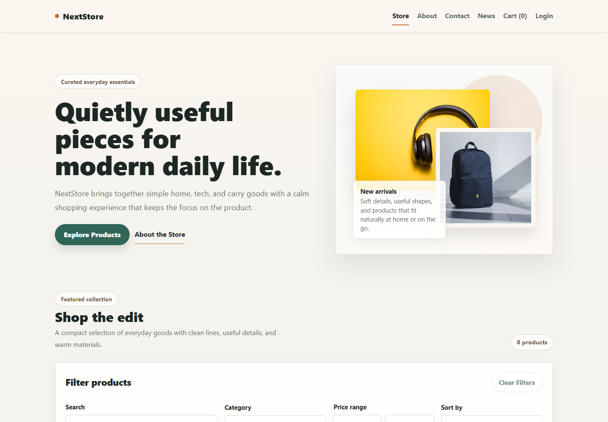
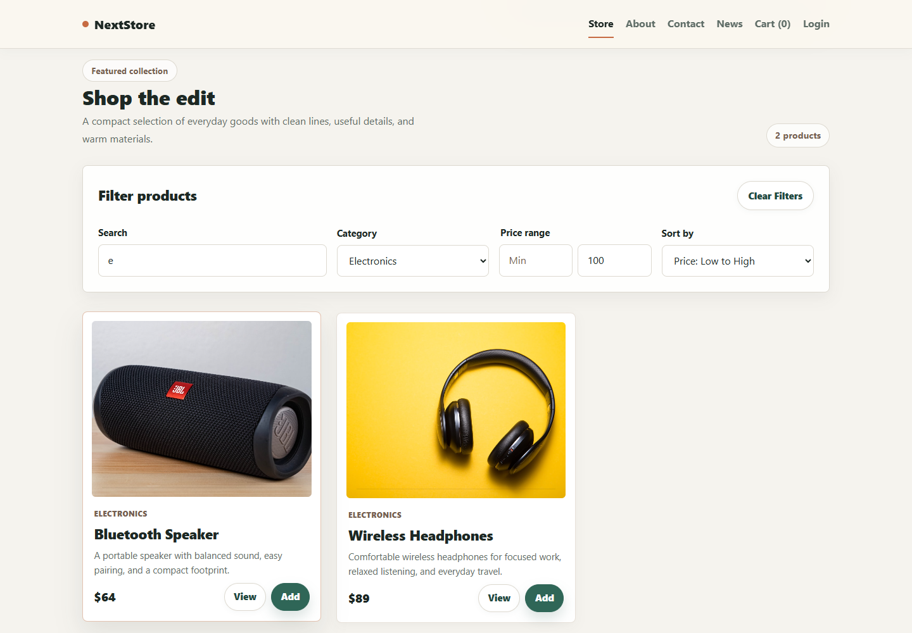
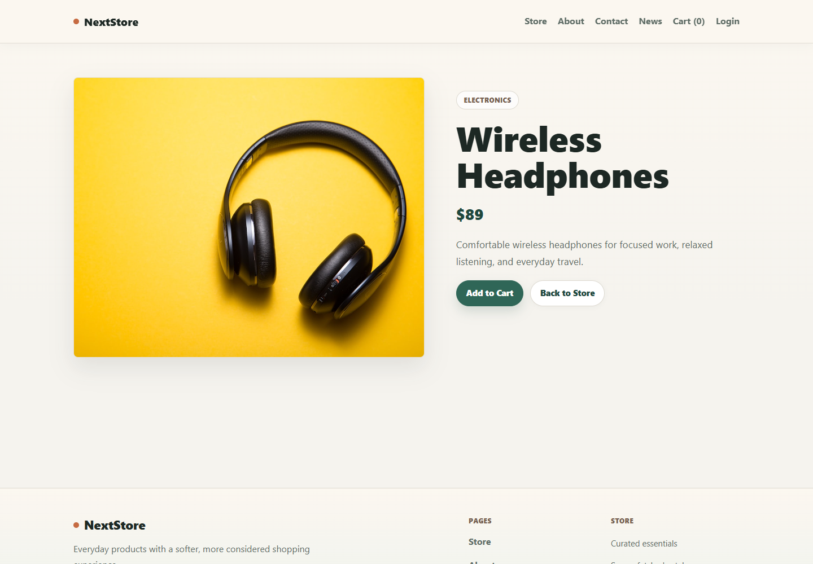
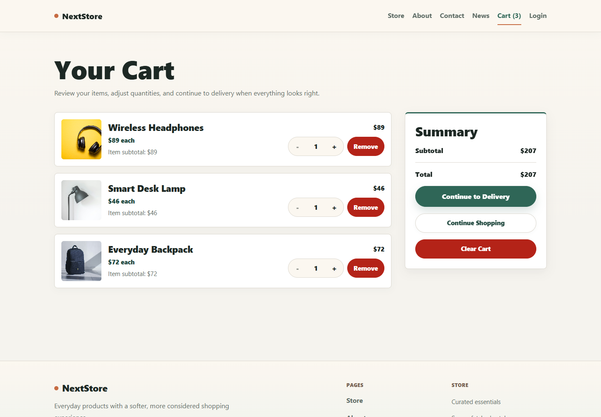
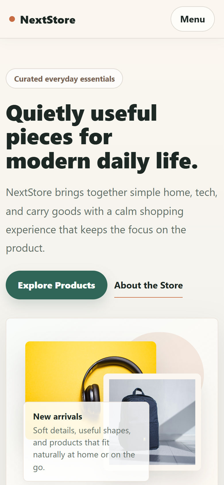

# NextStore

NextStore is a responsive storefront built with the Next.js App Router. It combines a server-fetched product catalog with client-side product discovery, a persistent Redux cart, guarded account routes, and a tested demo checkout flow.

**Live Demo:** _Add deployed URL here_

Repository: [github.com/mohadesehesmaeilzadeh/nextjs-store](https://github.com/mohadesehesmaeilzadeh/nextjs-store)

## Screenshots

### Home



### Product Discovery



### Product Details



### Shopping Cart



### Mobile Experience



## Features

- Server-rendered product listing and dynamic product detail pages
- Search by product name, category and price filters, and sorting controls
- Persistent shopping cart with quantity controls, removal, subtotal, and clear action
- Responsive storefront, cart, forms, navigation, and checkout pages
- Loading, error, empty, and custom not-found states
- Demo authentication with a protected account page
- Contact form validation and a multi-step demo checkout
- News content loaded through Apollo Client

## Tech Stack

- Next.js 16 and React 19
- JavaScript and styled-components
- Redux Toolkit and React Redux
- Apollo Client and GraphQL
- Jest, React Testing Library, and Playwright
- Storybook and ESLint

## Architecture

```text
src/
  app/                 App Router routes, layouts, API handlers, and route states
  components/          Storefront, cart, checkout, and shared UI components
  graphql/             GraphQL queries
  lib/                 Product normalization, fetching, auth, and integrations
  store/               Redux store, cart/checkout slices, and persistence provider
  styles/              Theme tokens and global styles
  test-utils/           Shared test fixtures and render helpers
tests/e2e/              Playwright user-flow tests
docs/screenshots/       Portfolio screenshots
```

The UI is organized around reusable styled-components and a shared theme. Server concerns remain in App Router pages and `src/lib`, while interactive catalog, cart, form, and checkout behavior stays in focused client components.

## App Router

The root layout provides the header, footer, theme, Apollo, and Redux providers. The storefront is server-rendered from `src/app/(store)/page.js`; product details use the dynamic `src/app/products/[id]/page.js` route. Route-level `loading.js`, `error.js`, and `not-found.js` files provide safe navigation states, and missing products call `notFound()`.

## Product Data

`src/lib/productCatalog.js` fetches listing and detail data from DummyJSON on the server with Next.js revalidation. Responses are normalized in `src/lib/productNormalizer.js` before reaching UI components, keeping the external API shape isolated from the storefront.

For deterministic end-to-end tests, the product API URL can be overridden with `PRODUCTS_API_URL`.

## Cart Persistence

Redux Toolkit owns cart actions and selectors. `StoreProvider` hydrates cart items from `localStorage` after mount and persists subsequent updates. Adding the same product increases its quantity, and totals are derived from the current cart state.

## Search, Filter, and Sort

The product listing supports name search, category selection, minimum and maximum prices, price ordering, and name ordering. Controls can be combined, reset together, and display live result counts and a no-results state. Sorting always works on a copied array so source product data is not mutated.

## Testing

Jest and React Testing Library cover components, Redux behavior, persistence, catalog normalization, filtering, route states, forms, and checkout flows. External product API requests are mocked in unit and integration tests.

Playwright covers critical browser flows including product browsing, combined filters, product details, invalid routes, cart persistence, checkout, authentication, navigation, and mobile layout. Its runner starts a local product API fixture to keep server-fetch tests deterministic.

```bash
npm test
npm run test:e2e
npm run test:coverage
```

## Responsive Design

The interface uses fluid containers, responsive grids, mobile navigation, visible keyboard focus, accessible form labels, and touch-friendly controls. Store, product, cart, checkout, and state views adapt across desktop, tablet, and mobile widths without changing their behavior.

## Installation

```bash
git clone https://github.com/mohadesehesmaeilzadeh/nextjs-store.git
cd nextjs-store
npm install
npm run dev
```

Open [http://localhost:3000](http://localhost:3000). Copy `.env.example` to `.env.local` only when environment overrides are needed.

## Available Scripts

| Command | Purpose |
| --- | --- |
| `npm run dev` | Start the Next.js development server |
| `npm run build` | Create a production build |
| `npm run start` | Run the production server |
| `npm run lint` | Run ESLint |
| `npm test` | Run Jest and React Testing Library tests |
| `npm run test:watch` | Run Jest in watch mode |
| `npm run test:coverage` | Generate Jest coverage |
| `npm run test:e2e` | Run Playwright tests |
| `npm run test:e2e:ui` | Open the Playwright test UI |
| `npm run test:all` | Run Jest and Playwright |
| `npm run storybook` | Start Storybook |
| `npm run build-storybook` | Build static Storybook output |

## Challenges

- Keeping browser-only cart persistence compatible with server rendering
- Normalizing remote product data without leaking API-specific fields into components
- Making combined filters predictable while preserving the original product collection
- Handling loading, API failure, and missing-product states at the route level
- Keeping end-to-end tests reliable when production data comes from an external service

## What I Learned

- How to divide App Router server components from interactive client components
- How Next.js caching and route boundaries shape data-loading UX
- How to persist Redux state safely after hydration
- How focused unit tests and a small browser suite complement each other
- How a shared theme improves consistency across responsive component states

## Roadmap

- Add the final portfolio screenshots and deployed demo URL
- Replace demo authentication and checkout with production services
- Add pagination or incremental catalog loading
- Improve image optimization with an approved remote image configuration
- Add automated accessibility checks to the browser suite
